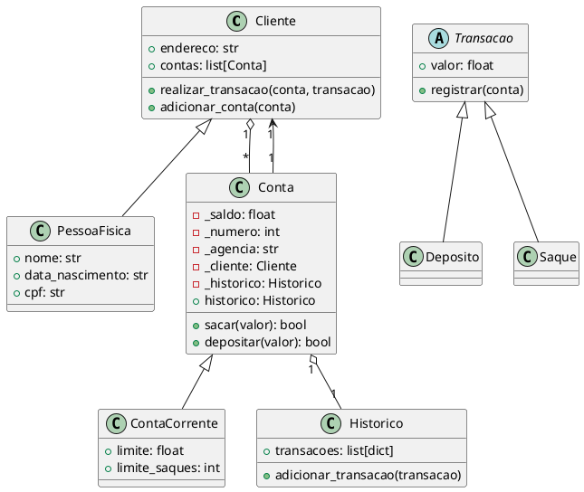

# bank_system

# Banco OO – CLI em Python.

Um pequeno sistema bancário **orientado a objetos** para terminal (CLI), com clientes, contas, histórico de transações e operações de **depósito**, **saque** e **extrato**.

> **Stack**: Python 3.10+ · CLI (stdin/stdout) · POO pura (sem frameworks)
> **Principais classes**: `Cliente`, `PessoaFisica`, `Conta`, `ContaCorrente`, `Historico`, `Transacao` (`Deposito`/`Saque`)

---

## ✨ Recursos

- Cadastro de **clientes (Pessoa Física)**
- Abertura de **contas correntes** por cliente
- **Depósito** e **saque** via transações encapsuladas
- **Limite de saque** por conta e **nº máximo de saques** (padrão: R$ 500,00 e 3 saques)
- **Histórico** registra cada transação (tipo e valor)
- **Extrato** formatado com saldo atual
- Menu **OO**: operações passam por `Cliente.realizar_transacao(conta, transacao)`

> Observação: O armazenamento é **em memória** (não persiste ao encerrar). Veja a seção _Roadmap_ para ideias de persistência.

---

## 🗂️ Estrutura (sugestão)

```
.
├── banco_oo.py           # código principal (CLI e domínio)
└── README.md             # este arquivo
```

> Se preferir, separe em módulos (ex.: `dominio/`, `cli/`, `tests/`).

---

## ▶️ Como executar

### 1) Pré-requisitos

- Python **3.10+**

### 2) (Opcional) Criar ambiente virtual

**Windows (PowerShell):**

```bash
python -m venv .venv
.venv\Scripts\Activate.ps1
```

**Linux/macOS:**

```bash
python3 -m venv .venv
source .venv/bin/activate
```

### 3) Rodar o app

```bash
python banco_oo.py
```

---

## 🧭 Uso (menu)

Ao iniciar, você verá:

```
================ MENU ================
[d]	Depositar
[s]	Sacar
[e]	Extrato
[nc]	Nova conta
[lc]	Listar contas
[nu]	Novo cliente
[q]	Sair
=>
```

### Fluxo típico

1. **nu** → cria um cliente (CPF único)
2. **nc** → cria uma conta para o CPF informado
3. **d** → deposita em uma conta do cliente
4. **s** → saca (respeitando saldo, limite por saque e limite de saques)
5. **e** → imprime o extrato (lista de transações + saldo)

> **Dica:** hoje, se um cliente possuir múltiplas contas, o sistema pega a **primeira** (`FIXME` marcado no código). Veja _Roadmap_ para seleção de conta.

---

## 🧩 Design de classes (POO)

- **Cliente**: mantém `endereco` e a lista `contas`. Executa `realizar_transacao(conta, transacao)`.
- **PessoaFisica(Cliente)**: adiciona `nome`, `data_nascimento`, `cpf`.
- **Conta**: possui `saldo`, `numero`, `agencia`, `cliente` e um `Historico`. Expõe `sacar()` e `depositar()`.
- **ContaCorrente(Conta)**: adiciona `limite` (valor máximo por saque) e `limite_saques` (quantidade por conta). Conta saques pelo `Historico`.
- **Historico**: armazena transações como dicts `{tipo, valor, data}`.
- **Transacao (abstrata)**: contrato para `valor` e `registrar(conta)`.

  - **Deposito** e **Saque**: implementam `registrar` chamando `conta.depositar/conta.sacar` e, em caso de sucesso, registram no `Historico`.

### PlantUML (diagrama de classes)



> Use uma extensão de PlantUML no seu editor ou um serviço online para visualizar.

---

## 🧪 Teste rápido (manual)

1. Crie um cliente e uma conta.
2. Deposite `1000`.
3. Saque `200` **quatro** vezes.

Espera-se que os **3 primeiros saques** ocorram; o **4º** seja **bloqueado** por limite de saques. Saques acima de `R$ 500,00` também serão bloqueados por limite por transação (valores padrão).

---

## 📄 Trechos importantes do Extrato

O extrato é exibido assim:

```
================ EXTRATO ================
Saque:
	R$ 200.00
Deposito:
	R$ 1000.00

Saldo:	R$ 800.00
```

> O histórico guarda `{tipo, valor, data}`; o extrato impresso foca em `tipo` e `valor` para leitura simples.

---

## 🛣️ Roadmap (sugestões)

- ✅ Limite de saque por conta e nº máximo de saques (via `Historico`)
- ◻️ Seleção de conta quando o cliente possuir múltiplas
- ◻️ Persistência (JSON/SQLite)
- ◻️ Logs estruturados (`logging`)
- ◻️ Testes automatizados (pytest) para herança, composição e integrações
- ◻️ Validações extras (CPF, data)
- ◻️ Internacionalização (mensagens)

---

## 🤝 Contribuindo

Sinta-se à vontade para abrir issues/melhorias. Sugestão de convenções:

- Commits semânticos (ex.: `feat:`, `fix:`, `refactor:`)
- PEP 8 / type hints
- Testes unitários com `pytest`

---

## 📜 Licença

Livre para uso acadêmico e didático. Adapte conforme sua necessidade.
